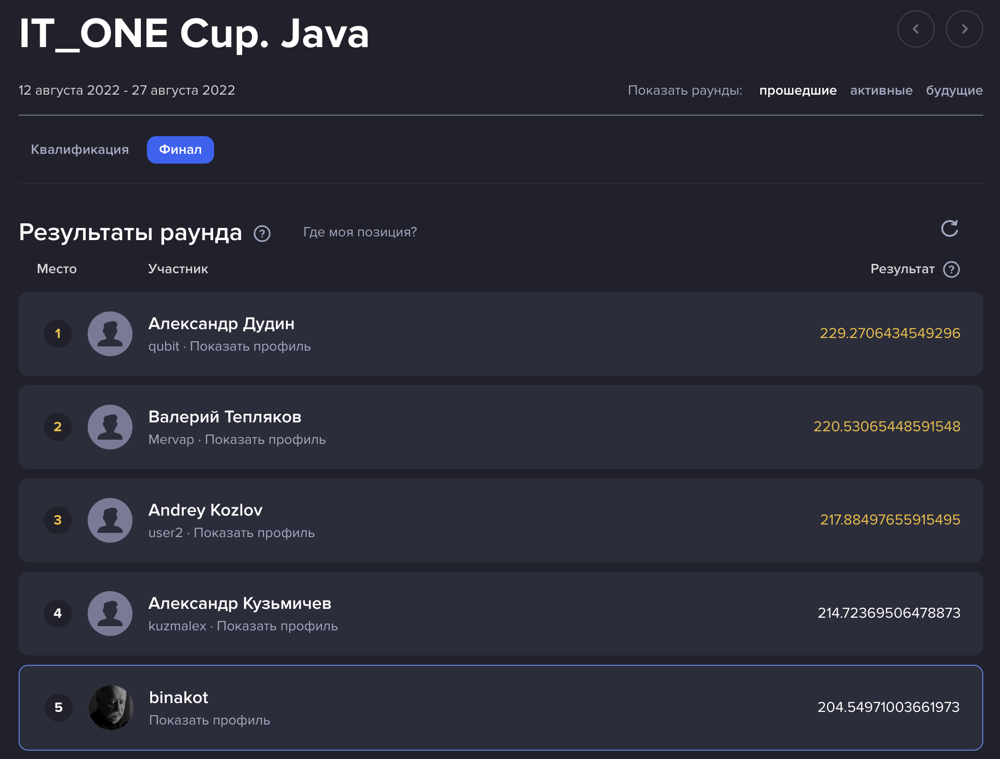

# IT_ONE Cup. Java

Онлайн чемпионат по направлению Java [https://cups.online/ru/contests/itonecup_java](https://cups.online/ru/contests/itonecup_java).

Поборись с другими профессионалами за призовой фонд в размере 740 тысяч рублей и получи предложение о работе в крутой технологической компании!

Проводится на платформе [https://cups.online](https://cups.online).

## Загрузка решения

Для решения задачи Вам нужно отправить в тест-систему собранный Docker-контейнер.
Чтобы это сделать, необходимо выполнить все действия указанные ниже.

1. Создать решение

Решение задачи состоит из двух частей: реализация Клиента и запуске его на проверочном сервере.

Процесс разработки Клиента производится у вас локально.
Для получения результата вам необходимо будет запустить его на нашем проверочном сервере.

2. Собрать контейнер

Необходимо подготовить Docker-контейнер для тестирования Вашего Клиента и получения результата у нас на сервере.

Для этого создайте Dockerfile.
Опишите в нем команды, которые нужно выполнить для запуска решения.
Если нужно — используйте дополнительные команды для установки библиотек или создания папок.
Присвойте контейнеру тег, который будет использоваться для локального запуска с помощью команды:

```bash
$ docker build -t my_solution .
```

3. Авторизоваться в хранилище

Перед отправкой решения в хранилище необходимо авторизоваться.
Для авторизации используйте следующие данные:

```bash
$ docker login stor.highloadcup.ru
> Username: binakot@gmail.com
> Password: 8d701f4c454f
```

4. Загрузите контейнер в репозиторий

Квалификация:

```bash
$ docker build -f builder.Dockerfile -t builder .
$ docker tag builder stor.highloadcup.ru/it_one_j22_qual/brave_koala
$ docker push stor.highloadcup.ru/it_one_j22_qual/brave_koala
```

Финал:

А: 

```bash
$ docker build -f checker.Dockerfile -t checker .
$ docker tag checker stor.highloadcup.ru/it_one_j22_final/exotic_koala
$ docker push stor.highloadcup.ru/it_one_j22_final/exotic_koala
```

B:

```bash
$ docker build -f checker.Dockerfile -t checker .
$ docker tag checker stor.highloadcup.ru/it_one_j22_final/elastic_indri
$ docker push stor.highloadcup.ru/it_one_j22_final/elastic_indri
```

5. Ожидание результата

Отправленный на проверку контейнер отобразится в интерфейсе рабочего пространства с небольшой задержкой по времени.
По каждому загруженному контейнеру Вам отображается его текущий статус.
По итогу тестирования решения будет опубликован его результат.

---

## Квалификация

Задача Квалификационного раунда - проверить базовые знания участников чемпионата и предоставить им возможность лучше подготовиться к финальному заданию.
Участниками квалификационного раунда автоматически становятся все зарегистрированные на чемпионат участники.

Вам будет дана 1 задача, которую нужно решить за отведенное время. Проверка решений осуществляется полностью автоматически. Задания выполняется каждым участником индивидуально.
За каждую корректную попытку загрузки решения по задаче автоматически рассчитывается балл по методике, которая будет опубликована одновременно с условием задачи.

Для перехода в основной раунд необходимо загрузить хотя бы одно решение, прошедшее автоматическую проверку и набравшее не нулевой балл.

### Раунд 1. Построитель отчетов.

Условия
Необходимо написать Spring-boot приложение, которое сможет управлять in-memory базой данных с помощью REST API.
Описание API доступно в приложенном файле API.pdf

Ваше приложение должно уметь обрабатывать запросы, позволяющие последовательно сформировать “отчет” по базе данных.
При этом сама база данных тоже будет наполняться через API.

Таким образом, на входе вашей системы будут запросы с исходными данными и со структурой желаемого отчета,
а на выходе - агрегированные в соответствии со структурой отчета данные.

Проверка решения будет проводиться внутренними тестами-сценариями.
То есть в общем случае, отдельный сценарий тестирования будет заключаться в следующего набора действий:

* формирование структуры БД (добавление таблиц, полей)
* наполнение БД данными (вставка записей в таблицы)
* формирование структуры желаемого отчета (конструирование запросов к БД)
* модификация данных (обновление и/или удаление записей в таблицах БД)
* получение сформированного отчета

Строгое соблюдение указанной выше последовательности действий не гарантируется - ваше приложение должно корректно обрабатывать входящие запросы в любой последовательности.
И в случаях некорректных или не имеющих смысла запросов приложение должно отвечать соответствующими кодами ошибок (см. описание api).

Обратите внимание!

В проверяющих тестах задачи квалификационного раунда предусмотрены далеко не все возможные комбинации корректных и ошибочных действий.
Однако для того, чтобы успешно решить задачу финального раунда, вам необходимо продумать и реализовать уже на этом этапе максимально отказоустойчивое приложение.
Рекомендуется проверять свое решение на собственных тестах - чем больше, тем лучше, вне зависимости от того, какой балл вы уже набрали в рамках квалификации.

Кроме того, важно учесть, что финальная версия решения квалификационной задачи будет “зафиксирована” на момент окончания раунда,
то есть на протяжении финала вы уже не сможете внести в нее изменения.

Пример решения
Во вложенном архиве sample_solution.zip вы можете найти пример минимального решения, иллюстрирующий базовые требования к приложению.

Обновление от 12.08.22 18:30

Для быстрого старта нужно проделать следующее:

установить Docker, если он еще не установлен
скачать архив sample_solution.zip, распаковать его
перейти в появившуюся после распаковки папку sample_solution (в ее корне должен лежать Dockerfile):
cd sample_solution
собрать локальный docker-образ своего решения:
docker build -t my_local_quickstart .
далее следовать инструкции, размещенной в Рабочем пространстве AllCups (вкладка "Загрузка решения") - там будут указаны уникальные для участника параметры (логин, пароль и теги).

Ограничения
Максимальное время работы приложения: 10 сек.
Максимальный объем использованной памяти: 1 Гб
Количество попыток в сутки: 20 (счетчик истраченных попыток сбрасывается в 00:00 МСК)

Прочее
После окончания тестирования ваше приложение будет завершено принудительно.

---

## Финал

В финальном раунде окончательно определяются победители чемпионата.
Вам будут предложена комплексная задача, на решение которой будет отведено 7 дней.
Проверка решений осуществляется полностью автоматически.
Подробное описание этапов решения задачи, методики расчета баллов и критериев ручной оценки станет доступно в момент старта Финального раунда.
Задания выполняется каждым участником индивидуально.
В процессе решения задачи вы будете набирать баллы, рассчитанные автоматически (аналогично Квалификационному раунду).
Лучшие ваши попытки будут попадать в предварительный лидерборд.
Однако финальный лидерборд будет опубликован после расчета дополнительных баллов, которые могут быть рассчитаны только после загрузки всех решений от всех участников.

### Раунд 2. Чекер

Условия
Задача финального раунда является продолжением задачи квалификации.
А именно, теперь вам предстоит разработать собственную тестирующую систему, которая сможет выявить как можно больше уязвимостей в квалификационных решениях других участников (включая свое собственное).

Проверка решений
API задачи остается неизменным, но ваше приложение теперь будет частично выполнять роль "чекера" - то есть обращаться к endpoint-ам решений оппонентов через проксирующий сервис основной тестирующей системы. Процесс проверки будет строиться из следующих шагов:
* Ваше приложение (далее - Чекер) передает прокси-сервису ожидаемый ответ на следующий запрос
* Чекер формирует непосредственно запрос в соответствии с API и отправляет его прокси-сервису
* Прокси-сервис тестирует полученный запрос на эталонном решении (далее - Эталон)
* Если Эталон вернул ответ, совпадающий с ответом, ожидаемым Чекером - тест признается корректным
* Если тест признан некорректным, работа чекера прекращается, за решение начисляется 0 баллов, а всем квалификационным решениям засчитывается 100 баллов за эту попытку
* Перед проверкой очередного квалификационного решения прокси-сервис отправляет Чекеру запрос на endpoint /api/start (то есть при корректной работе он вызовется столько раз, сколько будет проверено  квалификационных решений).

Система начисления баллов
Балл за финальную задачу будет складываться из двух оценок (по шкале от 0 до 100):

1. Насколько много Чекер участника нашел уязвимостей в квалификационных решениях оппонентов

2. Насколько хорошо квалификационное решение участника противостояло Чекерам оппонентов.

Первая часть будет считаться после каждой отправки попытки и, соответственно, отображаться в рейтинге.
Вторая часть рассчитается после окончания финала и будет скрыта до официальной церемонии оглашения результатов.
Кроме того, к общему итогу будет добавлен балл, набранный в квалификационном раунде.

Как оцениваются тесты
* Тесты разбиваются на "группы" аналогично группам из квалификации:
table tests
table query tests
single query tests
report tests
* Количество тестов (единичных обращений к endpoint-у) ограничено лимитом по каждой группе. Лимиты также соответствуют баллам из квалификационного раунда:
30: table tests
20: table query tests
20: single query tests
30: report tests
* Все тесты равнозначны по «стоимости» - за каждый тест начисляется (точнее - снимается с квалификационного решения) ровно 1 балл.
* Тестирование квалификационных решений осуществляет прокси.
* При тестировании квалификационного решения его балл уменьшается со 100 до 0 с каждым непройденным тестом. Ниже нуля балл опуститься не может.
* Если квалификационное решение не запустилось (недоступно для прокси) или упало в процессе - ему засчитывается 0 бал

* Параметры соединений
Чекер должен держать открытым порт 9081 (требуется реализовать единственный ендпоинт: /api/start
Прокси-сервис доступен по базовому URL, который нужно получить из переменной окружения rs.endpoint. Содержимое этой переменной будет состоять из назначенного динамически имени хоста и фиксированного порта:
http://some-host-name:9080

Примечание
Загрузка решений в задачу открыта, однако обновления API и проверяющей системы еще возможны.

---

# Итоги

5 призовое место из 144 участников.



Видео-трансляция с награждением: [https://www.youtube.com/watch?v=o2HN4JtcR4Q](https://www.youtube.com/watch?v=o2HN4JtcR4Q)
